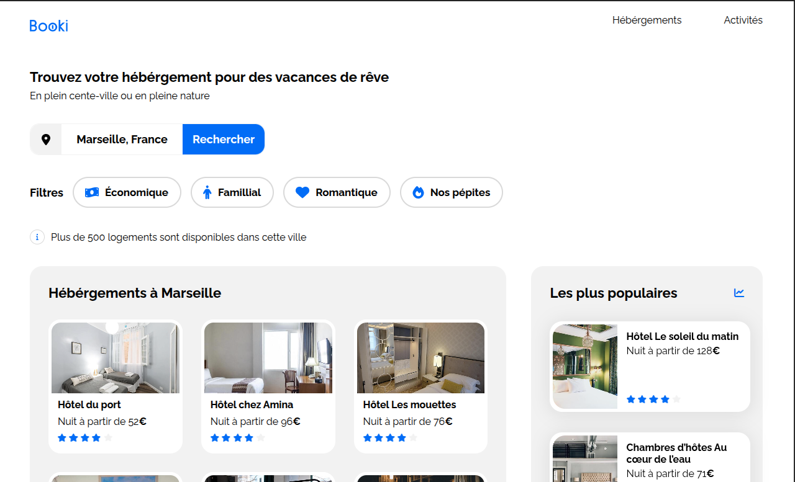

# Booki

## Description

Booki est la page d'accueil d'une agence de voyage fictive développée dans le cadre de la formation Développeur Intégrateur Web d'OpenClassrooms.

L'objectif du projet était d'intégrer une interface responsive à partir de maquettes Figma fournies pour les versions desktop, tablette et mobile. L'utilisateur peut consulter des hébergements et des activités organisés sous forme de cartes et utiliser une interface de recherche inspirée d'un cas réel.

## Objectifs

* Intégrer fidèlement une maquette Figma.
* Développer une interface responsive compatible mobile, tablette et desktop.
* Construire une mise en page moderne avec HTML et CSS.
* Utiliser Flexbox pour organiser les contenus.
* Respecter les bonnes pratiques d'intégration web.

## Technologies utilisées

* HTML5
* CSS3
* Flexbox
* Media Queries
* Font Awesome
* Google Fonts
* Visual Studio Code
* Figma

## Fonctionnalités

* Navigation responsive
* Barre de recherche
* Filtres interactifs
* Section Hébergements
* Section Les plus populaires
* Section Activités
* Footer responsive

## Compétences développées

* Intégration responsive
* Découpage de maquette
* HTML sémantique
* Flexbox
* Gestion des images et de l'accessibilité
* Responsive Design
* Validation HTML et CSS
* Débogage avec les DevTools

## Aperçu

Le site s'adapte aux résolutions :

* Mobile : à partir de 320px
* Tablette : jusqu'à 1024px
* Desktop : jusqu'à 1440px

## Lancer le projet

1. Cloner le dépôt.
2. Ouvrir le fichier `index.html` dans un navigateur.

## Auteur

Projet réalisé dans le cadre de la formation OpenClassrooms - Développeur Intégrateur Web.

